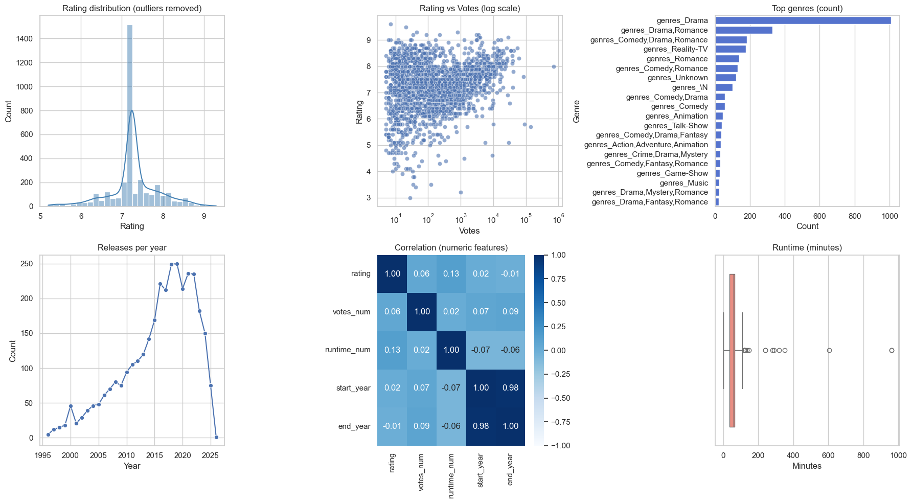
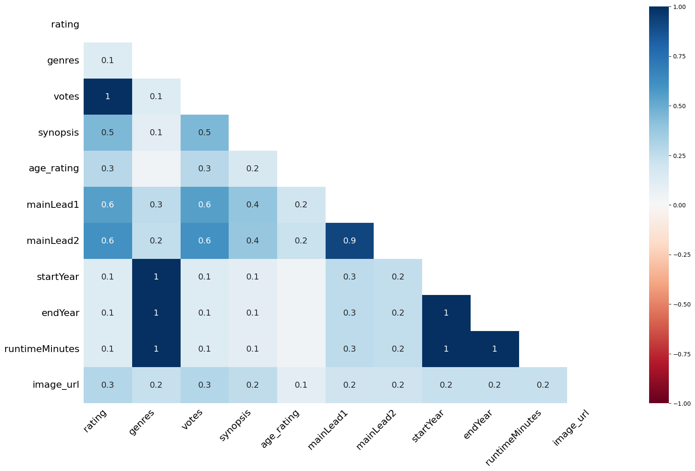
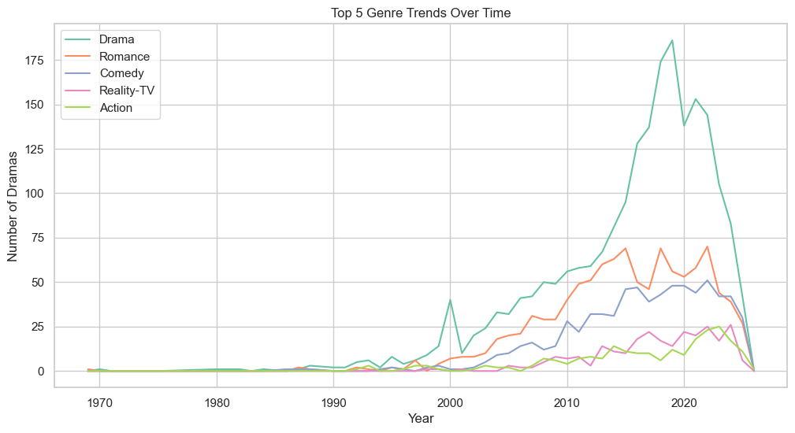

# K-Drama Analytics: Data Science & Machine Learning Project

This repository presents a comprehensive, end-to-end data science workflow for the analysis of the Ultimate Korean Drama Dataset (1969–2025). The project covers data cleaning, preprocessing, exploratory data analysis (EDA), visualization, and lays the foundation for advanced machine learning applications.


## 📊 Dataset Overview

- **Source:** [The Ultimate Korean Drama Dataset](https://www.kaggle.com/datasets/zeynepesennur/the-ultimate-korean-drama-dataset-19692025?resource=download)
- **Coverage:** 1,000+ K-dramas, 1969–2025
- **Key Features:**
   - `title`: Drama title
   - `rating`: IMDb rating (0–10)
   - `votes`: Number of votes (may be formatted as strings, e.g., "1.5K")
   - `genres`: Genre(s)
   - `synopsis`: Plot summary
   - `runtimeMinutes`: Episode duration
   - `startYear` / `endYear`: Broadcast years


## 🎯 Project Objectives

1. **Data Cleaning:** Address missing values, outliers, and inconsistencies for robust analysis
2. **Preprocessing:** Scale, normalize, and encode features for modeling
3. **Exploratory Analysis:** Uncover trends, genre distributions, and rating patterns
4. **Visualization:** Communicate insights through professional plots and heatmaps
5. **Reproducibility:** Provide a clear, modular workflow for future ML/AI tasks


## 🛠️ Installation & Setup

**Prerequisites:**
- Python 3.8+
- pip (or conda)

**Setup Steps:**
```bash
git clone https://github.com/lilswapnil/kdrama-analytics.git
cd kdrama-analytics
python3 -m venv .venv
source .venv/bin/activate  # macOS/Linux
pip install -r requirements.txt
```


## 📁 Project Structure

```
kdrama-analytics/
├── data/
│   ├── kdramas.csv                      # Raw dataset
│   └── cleaned_preprocessed_data.csv    # Cleaned output
├── test.ipynb                           # Main analysis notebook
├── requirements.txt                     # Dependencies
└── README.md                            # Project documentation
```


## 📝 Workflow Overview

1. **Data Import & Initial Exploration**
   - Load dataset, inspect schema, visualize missingness
2. **Data Cleaning**
   - Impute missing values, handle outliers, ensure consistency
3. **Feature Engineering & Preprocessing**
   - Scale/normalize numeric features, encode categoricals
4. **Exploratory Data Analysis (EDA)**
   - Visualize distributions, trends, and relationships
5. **Advanced Analysis**
   - Clustering, genre trends, word clouds, correlation analysis
6. **Export**
   - Save cleaned dataset for downstream ML/AI tasks


## 🚀 Usage

**Run the Full Analysis Pipeline:**

Open `test.ipynb` in Jupyter or VS Code and run all cells:
```bash
jupyter notebook test.ipynb
```
Or use the **Run All** button in the VS Code notebook editor.

**Output:**
- Cleaned data: `data/cleaned_preprocessed_data.csv`


## 📊 Key Insights (Sample)

- **Total dramas analyzed:** 1,000+
- **Rating range:** 0–10 (IMDb)
- **Peak years:** Most dramas aired in recent decades
- **Top genres:** Action, Romance, Comedy, Drama
- **Correlations:** Explored between rating, votes, runtime, and year

## 🎬 Sample Results

<p align="center">
   
   <br/>
   <em>Figure 1: Exploratory Data Analysis (EDA)</em>
</p>
<p align="center">
   
   <br/>
   <em>Figure 2: Missing Data Report</em>
</p>
<p align="center">
   
   <br/>
   <em>Figure 2: Top 5 Genre Trends Over Time</em>
</p>


## 🔧 Dependencies

All dependencies are listed in `requirements.txt`. Key packages include:

- pandas
- numpy
- scikit-learn
- scipy
- matplotlib
- seaborn
- missingno
- jupyter
- wordcloud

Install all with:
```bash
pip install -r requirements.txt
```


## 📈 Output Files

| File                          | Description                                 |
|-------------------------------|---------------------------------------------|
| `data/cleaned_preprocessed_data.csv` | Final cleaned dataset (ready for ML/AI)   |
| `test.ipynb`                  | Main notebook with all analysis & visuals   |


## 🐛 Troubleshooting

**Common Issues:**

- `NameError: name 'df_filled' not defined`: Run all cells in order (top to bottom)
- `ModuleNotFoundError: No module named 'missingno'`: Install with `pip install missingno`
- `votes` column not numeric: The notebook handles string-formatted votes (e.g., "1.5K"). See the `parse_votes()` function in the EDA section.


## 📚 Next Steps & Extensions

1. Predictive modeling (regression, classification)
2. Sentiment analysis on synopses
3. Recommendation systems (content-based, collaborative)
4. Time-series forecasting for drama popularity


## 📄 License

Dataset: [Kaggle License](https://www.kaggle.com/datasets/zeynepesennur/the-ultimate-korean-drama-dataset-19692025?resource=download)


## 👤 Author

Developed as a professional data science and machine learning project for educational and portfolio purposes.

---

**Last Updated:** January 7, 2026